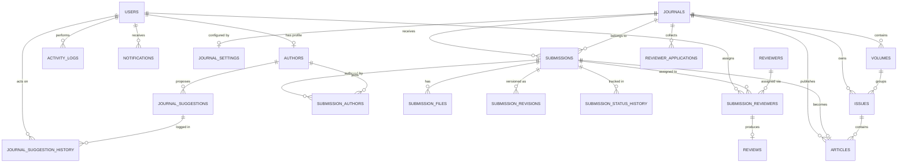

# Relational Database Schema — UORA Web App

Version: 1.0

Status: Active (mirrors `backend/prisma/schema.prisma`)

Database: MySQL (Prisma ORM)

---

This document describes every table, column, constraint, enum, and relationship in the UORA production schema. It reflects the **actual implemented** Prisma schema, not the planning notes in `SQL_Tables.md` / `Relationships.md`.

## Table of Contents

1. [Overview](#overview)
2. [Entity Relationship Diagram](#entity-relationship-diagram)
3. [Table Schemas](#table-schemas)
4. [Enums](#enums)
5. [Relationship Summary](#relationship-summary)

---

## Overview

The schema contains **21 tables** organized around four domains:

| Domain | Tables |
|---|---|
| Identity & Access | `users`, `admins`, `activity_logs`, `notifications` |
| Journal Organization | `journals`, `journal_settings`, `volumes`, `issues` |
| Submissions & Peer Review | `submissions`, `submission_revisions`, `submission_authors`, `submission_files`, `submission_status_history`, `submission_reviewers`, `reviews`, `reviewers`, `authors` |
| Publication & Suggestions | `articles`, `reviewer_applications`, `journal_suggestions`, `journal_suggestion_history` |

Conventions used by Prisma in this project:

- Primary keys: `id CHAR(36)` (UUID v4 generated by Prisma).
- Snake_case physical column names via `@map`; snake_case table names via `@@map`.
- Every mutable table carries `created_at` and `updated_at`; soft deletes use nullable `deleted_at`.
- `ON DELETE CASCADE` on all owning parent links unless noted otherwise.

---

## Entity Relationship Diagram

---

## Table Schemas

### 1. `users`

Central account table for all portal users (admin, editor, reviewer, author).

| Column | Type | Constraints | Default |
|---|---|---|---|
| id | CHAR(36) | PK | uuid() |
| name | VARCHAR(191) | NOT NULL | — |
| email | VARCHAR(191) | NOT NULL, UNIQUE | — |
| password | VARCHAR(191) | NOT NULL (hash) | — |
| role | ENUM(UserRole) | NOT NULL | AUTHOR |
| status | ENUM(UserStatus) | NOT NULL | ACTIVE |
| created_at | DATETIME(3) | NOT NULL | now() |
| updated_at | DATETIME(3) | NOT NULL | auto |

**Referenced by:** `authors.user_id` (nullable, unique), `activity_logs.user_id` (cascade), `submission_reviewers.assigned_by`, `notifications.user_id` (cascade), `journal_suggestion_history.action_by` (cascade).

---

### 2. `admins`

Platform super-admin accounts, separate from portal `users`. No foreign keys.

| Column | Type | Constraints | Default |
|---|---|---|---|
| id | CHAR(36) | PK | uuid() |
| full_name | VARCHAR(191) | NOT NULL | — |
| email | VARCHAR(191) | NOT NULL, UNIQUE | — |
| password_hash | VARCHAR(191) | NOT NULL | — |
| is_active | TINYINT(1) | NOT NULL | true |
| last_login | DATETIME(3) | NULL | — |
| created_at | DATETIME(3) | NOT NULL | now() |
| updated_at | DATETIME(3) | NOT NULL | auto |

---

### 3. `activity_logs`

Audit trail of user actions across modules.

| Column | Type | Constraints | Default |
|---|---|---|---|
| id | CHAR(36) | PK | uuid() |
| user_id | CHAR(36) | FK → users.id, ON DELETE CASCADE | — |
| action | ENUM(LogAction) | NOT NULL | — |
| module | VARCHAR(191) | NOT NULL | — |
| description | TEXT | NULL | — |
| ip_address | VARCHAR(191) | NULL | — |
| created_at | DATETIME(3) | NOT NULL | now() |

**Indexes:** `user_id`, `action`.

---

### 4. `notifications`

Per-user inbox messages.

| Column | Type | Constraints | Default |
|---|---|---|---|
| id | CHAR(36) | PK | uuid() |
| user_id | CHAR(36) | FK → users.id, ON DELETE CASCADE | — |
| title | VARCHAR(191) | NOT NULL | — |
| message | TEXT | NOT NULL | — |
| is_read | TINYINT(1) | NOT NULL | false |
| created_at | DATETIME(3) | NOT NULL | now() |

---

### 5. `journals`

A journal is the top-level publishing entity (multi-tenant root).

| Column | Type | Constraints | Default |
|---|---|---|---|
| id | CHAR(36) | PK | uuid() |
| name | VARCHAR(191) | NOT NULL | — |
| short_name | VARCHAR(191) | NOT NULL | — |
| slug | VARCHAR(191) | NOT NULL, UNIQUE | — |
| subdomain | VARCHAR(191) | NOT NULL, UNIQUE | — |
| issn | VARCHAR(191) | NULL | — |
| eissn | VARCHAR(191) | NULL | — |
| email | VARCHAR(191) | NULL | — |
| phone | VARCHAR(191) | NULL | — |
| status | ENUM(JournalStatus) | NOT NULL | ACTIVE |
| created_at | DATETIME(3) | NOT NULL | now() |
| updated_at | DATETIME(3) | NOT NULL | auto |
| deleted_at | DATETIME(3) | NULL (soft delete) | — |

**Children (all CASCADE):** `journal_settings` (1:1), `volumes`, `issues`, `submissions`, `articles`, `reviewer_applications`.
**Indexes:** `slug`, `subdomain`.

---

### 6. `journal_settings`

One-to-one public-facing configuration for each journal.

| Column | Type | Constraints | Default |
|---|---|---|---|
| id | CHAR(36) | PK | uuid() |
| journal_id | CHAR(36) | UNIQUE, FK → journals.id, ON DELETE CASCADE | — |
| logo | VARCHAR(191) | NULL | — |
| favicon | VARCHAR(191) | NULL | — |
| about | TEXT | NULL | — |
| aims_scope | TEXT | NULL | — |
| ethics | TEXT | NULL | — |
| guidelines | TEXT | NULL | — |
| contact_email | VARCHAR(191) | NULL | — |
| contact_phone | VARCHAR(191) | NULL | — |
| address | VARCHAR(191) | NULL | — |
| facebook | VARCHAR(191) | NULL | — |
| twitter | VARCHAR(191) | NULL | — |
| linkedin | VARCHAR(191) | NULL | — |
| created_at | DATETIME(3) | NOT NULL | now() |
| updated_at | DATETIME(3) | NOT NULL | auto |

---

### 7. `volumes`

Yearly grouping of issues per journal.

| Column | Type | Constraints | Default |
|---|---|---|---|
| id | CHAR(36) | PK | uuid() |
| journal_id | CHAR(36) | FK → journals.id, ON DELETE CASCADE | — |
| volume_number | INT | NOT NULL | — |
| year | INT | NOT NULL | — |
| created_at | DATETIME(3) | NOT NULL | now() |
| updated_at | DATETIME(3) | NOT NULL | auto |

**Unique:** `(journal_id, volume_number)` — a volume number is unique within a journal.
**Children:** `issues` (CASCADE).

---

### 8. `issues`

An issue belongs to both a journal and a volume.

| Column | Type | Constraints | Default |
|---|---|---|---|
| id | CHAR(36) | PK | uuid() |
| journal_id | CHAR(36) | FK → journals.id, ON DELETE CASCADE | — |
| volume_id | CHAR(36) | FK → volumes.id, ON DELETE CASCADE | — |
| issue_number | INT | NOT NULL | — |
| title | VARCHAR(191) | NULL | — |
| status | ENUM(IssueStatus) | NOT NULL | UPCOMING |
| published_at | DATETIME(3) | NULL | — |
| created_at | DATETIME(3) | NOT NULL | now() |
| updated_at | DATETIME(3) | NOT NULL | auto |

**Unique:** `(volume_id, issue_number)` — issue numbers are unique within a volume.
**Children:** `articles` (CASCADE).

---

### 9. `authors`

Author profiles. Optionally linked to a login account (`users`).

| Column | Type | Constraints | Default |
|---|---|---|---|
| id | CHAR(36) | PK | uuid() |
| user_id | CHAR(36) | NULL, UNIQUE, FK → users.id | — |
| full_name | VARCHAR(191) | NOT NULL | — |
| email | VARCHAR(191) | NULL | — |
| mobile | VARCHAR(191) | NULL | — |
| country | VARCHAR(191) | NULL | — |
| institution | VARCHAR(191) | NULL | — |
| designation | VARCHAR(191) | NULL | — |
| orcid | VARCHAR(191) | NULL | — |
| created_at | DATETIME(3) | NOT NULL | now() |
| updated_at | DATETIME(3) | NOT NULL | auto |
| deleted_at | DATETIME(3) | NULL (soft delete) | — |

**Children (CASCADE):** `submission_authors`, `journal_suggestions`.
**Indexes:** `email`.

---

### 10. `submissions`

Manuscript submitted to a journal for editorial workflow.

| Column | Type | Constraints | Default |
|---|---|---|---|
| id | CHAR(36) | PK | uuid() |
| journal_id | CHAR(36) | FK → journals.id, ON DELETE CASCADE | — |
| paper_id | VARCHAR(191) | NOT NULL, UNIQUE (public tracking ID) | — |
| title | VARCHAR(191) | NOT NULL | — |
| abstract | TEXT | NOT NULL | — |
| status | ENUM(SubmissionStatus) | NOT NULL | SUBMITTED |
| reviewer_requested | TINYINT(1) | NOT NULL | false |
| corresponding_email | VARCHAR(191) | NOT NULL | — |
| corresponding_phone | VARCHAR(191) | NULL | — |
| created_at | DATETIME(3) | NOT NULL | now() |
| updated_at | DATETIME(3) | NOT NULL | auto |
| deleted_at | DATETIME(3) | NULL (soft delete) | — |

**Children (CASCADE):** `submission_authors`, `submission_reviewers`, `submission_files`, `submission_revisions`, `submission_status_history`, `articles` (0..1).
**Indexes:** `journal_id`, `status`, `paper_id`.

---

### 11. `submission_authors` *(junction: submissions ↔ authors)*

Ordered author list per submission.

| Column | Type | Constraints | Default |
|---|---|---|---|
| id | CHAR(36) | PK | uuid() |
| submission_id | CHAR(36) | FK → submissions.id, ON DELETE CASCADE | — |
| author_id | CHAR(36) | FK → authors.id, ON DELETE CASCADE | — |
| author_order | INT | NOT NULL | 1 |
| is_corresponding | TINYINT(1) | NOT NULL | false |

**Unique:** `(submission_id, author_id)` — an author appears once per submission.
**Indexes:** `submission_id`, `author_id`.

---

### 12. `submission_files`

Uploaded manuscript/supplementary files per submission.

| Column | Type | Constraints | Default |
|---|---|---|---|
| id | CHAR(36) | PK | uuid() |
| submission_id | CHAR(36) | FK → submissions.id, ON DELETE CASCADE | — |
| file_type | ENUM(FileType) | NOT NULL | — |
| original_name | VARCHAR(191) | NOT NULL | — |
| stored_name | VARCHAR(191) | NOT NULL | — |
| file_path | VARCHAR(191) | NOT NULL | — |
| mime_type | VARCHAR(191) | NULL | — |
| file_size | INT | NULL | — |
| uploaded_at | DATETIME(3) | NOT NULL | now() |

**Indexes:** `submission_id`.

---

### 13. `submission_revisions`

Version history of revised manuscripts.

| Column | Type | Constraints | Default |
|---|---|---|---|
| id | CHAR(36) | PK | uuid() |
| submission_id | CHAR(36) | FK → submissions.id, ON DELETE CASCADE | — |
| revision_number | INT | NOT NULL | 1 |
| remarks | TEXT | NULL | — |
| file_path | VARCHAR(191) | NOT NULL | — |
| original_name | VARCHAR(191) | NOT NULL | — |
| stored_name | VARCHAR(191) | NOT NULL | — |
| submitted_at | DATETIME(3) | NOT NULL | now() |

**Indexes:** `submission_id`.

---

### 14. `submission_status_history`

Append-only log of every submission status transition.

| Column | Type | Constraints | Default |
|---|---|---|---|
| id | CHAR(36) | PK | uuid() |
| submission_id | CHAR(36) | FK → submissions.id, ON DELETE CASCADE | — |
| status | ENUM(SubmissionStatus) | NOT NULL | — |
| remarks | TEXT | NULL | — |
| changed_at | DATETIME(3) | NOT NULL | now() |

**Indexes:** `submission_id`.

---

### 15. `reviewers`

External reviewer pool (independent of `users` accounts).

| Column | Type | Constraints | Default |
|---|---|---|---|
| id | CHAR(36) | PK | uuid() |
| full_name | VARCHAR(191) | NOT NULL | — |
| email | VARCHAR(191) | NOT NULL, UNIQUE | — |
| mobile | VARCHAR(191) | NULL | — |
| country | VARCHAR(191) | NULL | — |
| institution | VARCHAR(191) | NULL | — |
| designation | VARCHAR(191) | NULL | — |
| expertise | TEXT | NULL | — |
| is_active | TINYINT(1) | NOT NULL | true |
| created_at | DATETIME(3) | NOT NULL | now() |
| updated_at | DATETIME(3) | NOT NULL | auto |
| deleted_at | DATETIME(3) | NULL (soft delete) | — |

**Children:** `submission_reviewers` (CASCADE).
**Indexes:** `email`.

---

### 16. `submission_reviewers` *(junction: submissions ↔ reviewers)*

Review assignment lifecycle for one reviewer on one submission.

| Column | Type | Constraints | Default |
|---|---|---|---|
| id | CHAR(36) | PK | uuid() |
| submission_id | CHAR(36) | FK → submissions.id, ON DELETE CASCADE | — |
| reviewer_id | CHAR(36) | FK → reviewers.id, ON DELETE CASCADE | — |
| assigned_by | CHAR(36) | FK → users.id (assigning staff) | — |
| deadline | DATETIME(3) | NULL | — |
| remarks | TEXT | NULL | — |
| status | ENUM(ReviewAssignmentStatus) | NOT NULL | PENDING |
| assigned_at | DATETIME(3) | NOT NULL | now() |
| accepted_at | DATETIME(3) | NULL | — |
| completed_at | DATETIME(3) | NULL | — |
| created_at | DATETIME(3) | NOT NULL | now() |
| updated_at | DATETIME(3) | NOT NULL | auto |

**Unique:** `(submission_id, reviewer_id)` — a reviewer is assigned once per submission.
**Child:** `reviews` (0..1, CASCADE).
**Indexes:** `submission_id`, `reviewer_id`, `assigned_by`.

---

### 17. `reviews`

Completed review produced from an assignment.

| Column | Type | Constraints | Default |
|---|---|---|---|
| id | CHAR(36) | PK | uuid() |
| submission_reviewer_id | CHAR(36) | UNIQUE, FK → submission_reviewers.id, ON DELETE CASCADE | — |
| recommendation | ENUM(ReviewRecommendation) | NOT NULL | — |
| overall_rating | INT | NULL | — |
| comments_to_author | TEXT | NULL | — |
| comments_to_editor | TEXT | NULL | — |
| submitted_at | DATETIME(3) | NOT NULL | now() |
| created_at | DATETIME(3) | NOT NULL | now() |
| updated_at | DATETIME(3) | NOT NULL | auto |

The `UNIQUE` FK makes this a strict **1:1** with `submission_reviewers`.

---

### 18. `articles`

Published record created from an accepted submission.

| Column | Type | Constraints | Default |
|---|---|---|---|
| id | CHAR(36) | PK | uuid() |
| journal_id | CHAR(36) | FK → journals.id, ON DELETE CASCADE | — |
| issue_id | CHAR(36) | FK → issues.id, ON DELETE CASCADE | — |
| submission_id | CHAR(36) | UNIQUE, FK → submissions.id, ON DELETE CASCADE | — |
| title | VARCHAR(191) | NOT NULL | — |
| doi | VARCHAR(191) | NULL, UNIQUE | — |
| pages | VARCHAR(191) | NULL | — |
| pdf_url | VARCHAR(191) | NULL | — |
| scheduled_publish_at | DATETIME(3) | NULL | — |
| published_at | DATETIME(3) | NULL | — |
| created_at | DATETIME(3) | NOT NULL | now() |
| updated_at | DATETIME(3) | NOT NULL | auto |

The `UNIQUE` FK on `submission_id` enforces **one article per submission**.
**Indexes:** `journal_id`, `issue_id`.

---

### 19. `reviewer_applications`

Public applications to join a journal's reviewer pool.

| Column | Type | Constraints | Default |
|---|---|---|---|
| id | CHAR(36) | PK | uuid() |
| journal_id | CHAR(36) | FK → journals.id, ON DELETE CASCADE | — |
| full_name | VARCHAR(191) | NOT NULL | — |
| email | VARCHAR(191) | NOT NULL | — |
| mobile | VARCHAR(191) | NULL | — |
| institution | VARCHAR(191) | NULL | — |
| designation | VARCHAR(191) | NULL | — |
| expertise | TEXT | NULL | — |
| cv_file | VARCHAR(191) | NULL | — |
| status | ENUM(ReviewerStatus) | NOT NULL | PENDING |
| created_at | DATETIME(3) | NOT NULL | now() |
| updated_at | DATETIME(3) | NOT NULL | auto |

**Indexes:** `journal_id`, `email`.

---

### 20. `journal_suggestions`

Author proposals for launching new journals.

| Column | Type | Constraints | Default |
|---|---|---|---|
| id | CHAR(36) | PK | uuid() |
| author_id | CHAR(36) | FK → authors.id, ON DELETE CASCADE | — |
| title | VARCHAR(191) | NOT NULL | — |
| subject_domain | TEXT | NOT NULL | — |
| description | TEXT | NOT NULL | — |
| reason | TEXT | NOT NULL | — |
| supporting_info | TEXT | NULL | — |
| attachment_url | VARCHAR(191) | NULL | — |
| status | ENUM(JournalSuggestionStatus) | NOT NULL | SUBMITTED |
| created_at | DATETIME(3) | NOT NULL | now() |
| updated_at | DATETIME(3) | NOT NULL | auto |

**Children:** `journal_suggestion_history` (CASCADE).

---

### 21. `journal_suggestion_history`

Workflow audit trail for suggestion status changes.

| Column | Type | Constraints | Default |
|---|---|---|---|
| id | CHAR(36) | PK | uuid() |
| suggestion_id | CHAR(36) | FK → journal_suggestions.id, ON DELETE CASCADE | — |
| status | ENUM(JournalSuggestionStatus) | NOT NULL | — |
| action_by | CHAR(36) | FK → users.id, ON DELETE CASCADE | — |
| remarks | TEXT | NULL | — |
| created_at | DATETIME(3) | NOT NULL | now() |

---

## Enums

| Enum | Values |
|---|---|
| UserRole | ADMIN, SUB_ADMIN, EDITOR, REVIEWER, AUTHOR |
| UserStatus | ACTIVE, INACTIVE, BLOCKED |
| JournalStatus | ACTIVE, INACTIVE |
| SubmissionStatus | DRAFT, SUBMITTED, INITIAL_SCREENING, UNDER_REVIEW, REVISION_REQUIRED, REVISED_SUBMITTED, ACCEPTED, REJECTED, PUBLISHED |
| ReviewAssignmentStatus | PENDING, ACCEPTED, DECLINED, COMPLETED |
| ReviewRecommendation | ACCEPT, MINOR_REVISION, MAJOR_REVISION, REJECT |
| ReviewerStatus | PENDING, APPROVED, REJECTED |
| JournalSuggestionStatus | SUBMITTED, UNDER_EDITOR_REVIEW, EDITOR_RECOMMENDED, ADMIN_REVIEW, CHANGES_REQUESTED, APPROVED, REJECTED, CLOSED |
| FileType | MANUSCRIPT, REVISION, SUPPLEMENTARY, ARTICLE_PDF, REVIEWER_CV |
| IssueStatus | UPCOMING, PUBLISHED |
| LogAction | CREATE, UPDATE, DELETE, LOGIN, LOGOUT, PUBLISH |

---

## Relationship Summary

| # | Parent | Child | Cardinality | FK Column | On Delete |
|---|---|---|---|---|---|
| 1 | users | authors | 1 : 0..1 | authors.user_id (UNIQUE) | Restrict |
| 2 | users | activity_logs | 1 : N | activity_logs.user_id | CASCADE |
| 3 | users | notifications | 1 : N | notifications.user_id | CASCADE |
| 4 | users | submission_reviewers | 1 : N (as assigner) | submission_reviewers.assigned_by | Restrict |
| 5 | users | journal_suggestion_history | 1 : N | journal_suggestion_history.action_by | CASCADE |
| 6 | journals | journal_settings | 1 : 1 | journal_settings.journal_id (UNIQUE) | CASCADE |
| 7 | journals | volumes | 1 : N | volumes.journal_id | CASCADE |
| 8 | journals | issues | 1 : N | issues.journal_id | CASCADE |
| 9 | journals | submissions | 1 : N | submissions.journal_id | CASCADE |
| 10 | journals | articles | 1 : N | articles.journal_id | CASCADE |
| 11 | journals | reviewer_applications | 1 : N | reviewer_applications.journal_id | CASCADE |
| 12 | volumes | issues | 1 : N | issues.volume_id | CASCADE |
| 13 | issues | articles | 1 : N | articles.issue_id | CASCADE |
| 14 | submissions | articles | 1 : 0..1 | articles.submission_id (UNIQUE) | CASCADE |
| 15 | submissions ↔ authors | submission_authors | M : N | submission_authors.submission_id / author_id | CASCADE |
| 16 | submissions ↔ reviewers | submission_reviewers | M : N | submission_reviewers.submission_id / reviewer_id | CASCADE |
| 17 | submissions | submission_files | 1 : N | submission_files.submission_id | CASCADE |
| 18 | submissions | submission_revisions | 1 : N | submission_revisions.submission_id | CASCADE |
| 19 | submissions | submission_status_history | 1 : N | submission_status_history.submission_id | CASCADE |
| 20 | submission_reviewers | reviews | 1 : 0..1 | reviews.submission_reviewer_id (UNIQUE) | CASCADE |
| 21 | authors | journal_suggestions | 1 : N | journal_suggestions.author_id | CASCADE |
| 22 | journal_suggestions | journal_suggestion_history | 1 : N | journal_suggestion_history.suggestion_id | CASCADE |

### Key Design Notes

- **Two identity systems:** `admins` (platform staff) is fully isolated; `users` (portal accounts) hold a single `UserRole`. An extended RBAC model (`roles`/`permissions`/`user_roles`) remains a future plan per `Relationships.md`.
- **Review chain:** `Submission → SubmissionReviewer → Review` — the assignment row tracks PENDING/ACCEPTED/DECLINED/COMPLETED, and the review row exists only once the assignment is completed (1:1).
- **Lifecycle preservation:** revisions (`submission_revisions`) and transitions (`submission_status_history`) are append-only, so no editorial state is ever overwritten.
- **Publication bridge:** `articles.submission_id` (UNIQUE) guarantees exactly-once promotion of an accepted submission into the published hierarchy `Journal → Volume → Issue → Article`.
- **Soft deletes** (`deleted_at`) exist on `journals`, `authors`, `reviewers`, and `submissions`; hard cascading deletes everywhere else.
